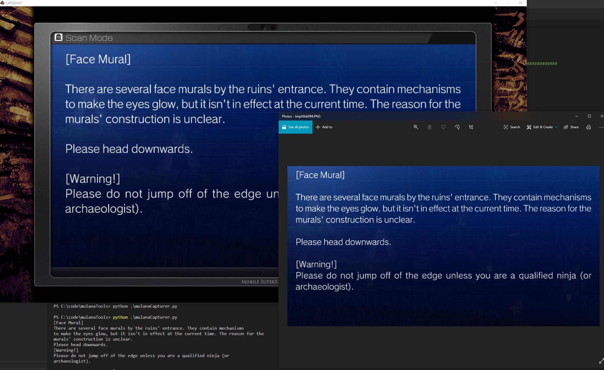

## Requirements:

Windows 10 with Python 3.8 installed

Python dependencies installed (pywin32, pyautogui, google-cloud-vision)

La Mulana 2 needs to be running in a 1920x1080 window

You need to sign up for Google Cloud Vision and your own credentials stored in GOOGLE_APPLICATION_CREDENTIALS (in your path)

